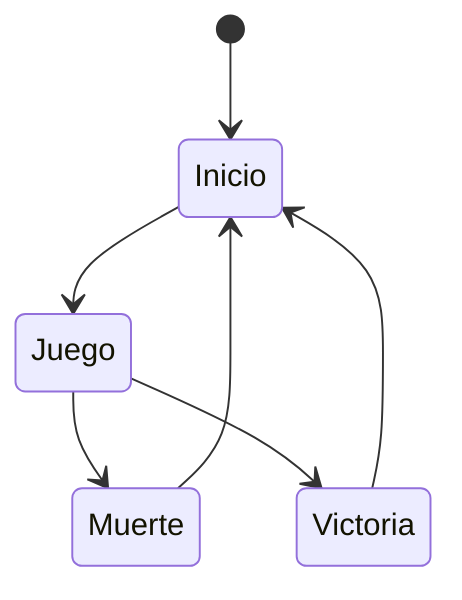

# IAV - Base para la Práctica 1

## Autores
- Pablo Arredondo Nowak (PabloArrNowak)
- Mario Miguel Cuartero (mamigu05)

Link a Drive: https://drive.google.com/drive/folders/1AHgQ-kmif37ZuDwvxa-xuaC1nTWuftLC?usp=share_link

## Propuesta
A partir de la base proporcionada, se deben diseñar e implementar soluciones para los siguientes comportamientos, indicados en https://narratech.com/es/inteligencia-artificial-para-videojuegos/percepcion-y-movimiento/plaga-de-ratas/ :

Avatar del Jugador: **Flautista**, se mueve por el mapa (actualmente por teclado, debe ser por ratón) y puede tocar la flauta (click derecho). 

**Ratas**: Deambulan por su cuenta. Cuando se toca la flauta, siguen al **flautista** en grupo.

**Perro**: Persigue al flautista con predicción, hasta que se le acercan 2 o más **ratas**, que lo hacen huir.

## Punto de partida
Se parte de un proyecto base de Unity proporcionado por el profesor aquí:
https://github.com/Narratech/IAV-P1

Esta base incluye un avatar de **flautista** controlable por teclado, un **panel de información** en la esquina superior izquierda que indica los FPS actuales y cuenta el número de **ratas** activas, aunque este contador no se actualiza por ahora; otro panel en la esquina superior derecha, que indica los **controles** del juego (de nuevo, en teclado); un **escenario** simple con casas, árboles y un pozo; un **generador de ratas** que responde a input del jugador (teclado), aunque las **ratas** se generan en el mismo punto, haciendo que se apilen; y prefabs para el **perro** y las **ratas** que no hacen nada por ahora.

Se incluyen los siguientes scripts/clases:

- **Merodear**, que no está implementada, pero hará deambular a las ratas.

- **ControlJugador**, que hereda de la clase "ComportamientoAgente" y que, en principio, controlaba el movimiento y la dirección del avatar del jugador con el teclado, pero que ahora está implementado el control con ratón.

- **Llegada**, que hereda de la clase "ComportamientoAgente" y que hace que el agente que lo tenga siga a un agente asignado como objetivo.

- **Huir**, que no está implementado, pero hará huir al perro cuando haya más de dos ratas cerca de él.

- **Separacion**, que no está implementado, pero hará que las ratas mantengan su dirección pero con separación entre unas y otras.

- **TocarFlauta**, que activa varios sistemas de partículas al pulsar una tecla determinada y permite que las ratas activen y desactiven ciertos comportamientos que hacen que sigan o no al avatar del jugador.

- **Agente**, que es usado por todos los personajes y permite mover a los personajes en base a las direcciones que tiene.

- **ComportamientoAgente**, que es la clase de la cual heredan varios scripts de los personajes y que declaran ciertas variables y devuelven direcciones.

- **Direccion**, que es una clase que representa la dirección mediante aceleraciones.

- **GestorJuego**, que es una clase que gestiona cada ámbito del juego como: la información que sale en pantalla; el spawn y despawn de ratas; la acción de volver a empezar la escena; cambio de vista de cámara...


## Diseño de la solución

Lo que vamos a realizar para resolver esta práctica es...

El pseudocódigo del algoritmo de llegada utilizado es:
```
class Arrive:
    character: Kinematic
    target: Kinematic

    maxAcceleration: float
    maxSpeed: float

    # The radius for arriving at the target.
    targetRadius: float

    # The radius for beginning to slow down.
    slowRadius: float

    # The time over which to achieve target speed.
    timeToTarget: float = 0.1

    function getSteering() -> SteeringOutput:
        result = new SteeringOutput()

        # Get the direction to the target.
        direction = target.position - character.position
        distance = direction.length()

        # Check if we are there, return no steering.
        if distance < targetRadius:
            return null

        # If we are outside the slowRadius, then move at max speed.
        if distance > slowRadius:
            targetSpeed = maxSpeed
        # Otherwise calculate a scaled speed.
        else:
            targetSpeed = maxSpeed * distance / slowRadius

        # The target velocity combines speed and direction.
         targetVelocity = direction
        targetVelocity.normalize()
        targetVelocity *= targetSpeed

        # Acceleration tries to get to the target velocity.
        result.linear = targetVelocity - character.velocity
        result.linear /= timeToTarget

        # Check if the acceleration is too fast.
        if result.linear.length() > maxAcceleration:
            result.linear.normalize()
            result.linear *= maxAcceleration

        result.angular = 0
        return result
```

El pseudocódigo del algoritmo de movimiento de huida es...

También es posible mostrar diagramas...


Mejor que insertando imágenes, se puede usar Mermaid:



## Pruebas y métricas

- [Vídeo con la batería de pruebas](https://youtu.be/xxxxx)

## Ampliaciones

Se han realizado las siguientes ampliaciones

- Los obstáculos del escenario se colocan...

## Producción

Las tareas se han realizado y el esfuerzo ha sido repartido entre los autores.

| Estado  |  Tarea  |  Fecha  |  
|:-:|:--|:-:|
| ✔ | Diseño: Primer borrador | 2-12-2022 |
| ✔ | Característica A: Nosequé | 11-12-2022 |
| ✔ | Característica B: Nosecuentos| 12-12-2022 |
|   | ... | |
|  | OPCIONAL |  |
| ✔ | Generador pseudoaleatorio | 3-12-2022 |
| :x: | Menú | 3-12-2022 |
| :x: | HUD | 12-12-2022 |

## Referencias

Los recursos de terceros utilizados son de uso público.

- *AI for Games*, Ian Millington.
- [Kaykit Medieval Builder Pack](https://kaylousberg.itch.io/kaykit-medieval-builder-pack)
- [Kaykit Dungeon](https://kaylousberg.itch.io/kaykit-dungeon)
- [Kaykit Animations](https://kaylousberg.itch.io/kaykit-animations)
